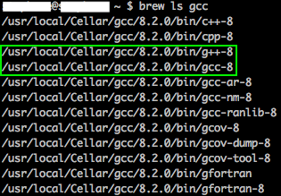

<!-- Installation -->
<style>
  h1, h2, h3 { color: #04A9F4; }
	pre { color: black !important; }
</style>

# Installation

Since this package contains C++ source code, pip needs a C++ compiler to install PySurvival.

## 1 - Installing C++ compiler

### On MacOS

1. Install brew - go on [http://brew.sh/](http://brew.sh/) and follow the provided instructions
2. Install the latest version of gcc with the command :

	* If you have never installed gcc, use:
	<pre><code class="bash">brew install gcc
	</pre></code>

	* If you have already installed gcc and want the latest version:
	<pre><code class="bash">brew upgrade gcc
	</pre></code>

3. Get the list all the gcc files with the command:
		
	<pre><code class="bash">brew ls gcc</pre></code>
<center></center>

4. Assign the environment variables CC and CXX to the previously found addresses, by entering the following lines in the terminal:
	<pre><code class="bash">export CXX=/usr/local/Cellar/gcc/8.2.0/bin/g++-8
export CC=/usr/local/Cellar/gcc/8.2.0/bin/gcc-8</pre></code>


*<u>**Note:**</u> As of October 18, 2018, the latest version on MacOS is 8.2.0, hence the use of `8.2.0`; feel free to use the version that matches your situation instead.*

---

### On Linux


#### CentOS7

1. Install GCC with the command :
<pre><code class="bash">sudo yum install centos-release-scl
sudo yum install devtoolset-8-gcc devtoolset-8-gcc-c++  -y
</pre></code>
*<u>**Note:**</u> As of March 2019, the latest version of gcc is 8, hence the use of `devtoolset-8`; feel free to use the version that matches your situation instead.*

2. Assign the environment variables CC and CXX to the appropriate files:
<pre><code class="bash">export CXX=/opt/rh/devtoolset-8/root/usr/bin/x86_64-redhat-linux-g++
export CC=/opt/rh/devtoolset-8/root/usr/bin/x86_64-redhat-linux-gcc
</pre></code>


#### Ubuntu

1. Install GCC with the command :
<pre><code class="bash">sudo apt install gcc-8 g++-8
</pre></code>
*<u>**Note:**</u> As of March 2019, the latest version of gcc is 8, hence the use of `gcc-8 g++-8`; feel free to use the version that matches your situation instead.*

2. Assign the environment variables CC and CXX to the appropriate files:
<pre><code class="bash">export CXX=/usr/bin/g++-8
export CC=/usr/bin/gcc-8
</pre></code>


---

## 2 - Installation via from PyPI (recommended)
The easiest way to install pySurvival is to use to pip:

```bash
pip install pysurvival
```

-------

## Potential Issues


### Issues with matplotlib on MacOS

If you encounter the following error:

!!! error " Error with matplotlib"
	RuntimeError: Python is not installed as a framework. The Mac OS X backend will not be able to function correctly if Python is not installed as a framework.


You'll need to ensure that there exists a file `~/.matplotlib/matplotlibrc` containing the code: `backend: TkAgg`. To do this, run the following code in your Terminal:

```bash
cd
echo "backend: TkAgg" >> ~/.matplotlib/matplotlibrc
```