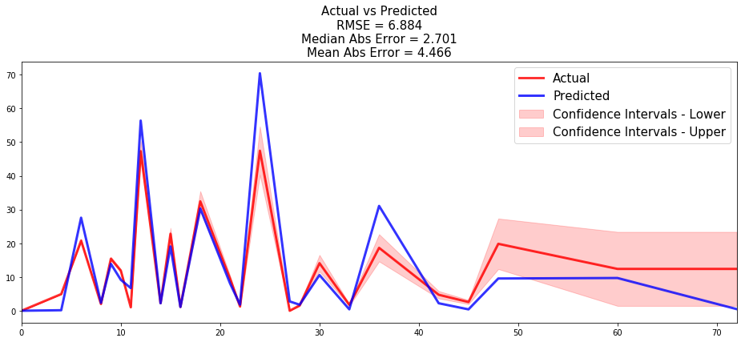

<!-- Tips on building models -->
<style>
  h1, h2, h3, h4 { color: #04A9F4; }
</style>

# Tips on building models

## Reaching complete optimization
It is advised to check the loss function values of the model once fitted to ensure that the best model parameters were computed. This can be done with the function `pysurvival.utils.display.display_loss_values`.

If the loss function reached a minimum, it will display a plateau after a certain number of epochs. If it is not the case the model will provide sub-optimal results. To solve this, it is advised to :

* either increase the learning rate `lr` 
* or increase the number of epochs `num_epochs`.


Let's illustrate this with an example:

* Here we will build a model with a low learning rate; as a result the model will yield poor performances
```python
from pysurvival.models.semi_parametric import NonLinearCoxPHModel
from pysurvival.utils.display import display_loss_values
from pysurvival.utils.metrics import concordance_index
from pysurvival.datasets import Dataset
%pylab inline

# Loading and splitting a simple example into train/test sets
X_train, T_train, E_train, \
	X_test, T_test, E_test = Dataset('simple_example').load_train_test()

# Let's build a Nonlinear CoxPH model
structure = [ {'activation': 'Atan', 'num_units': 150},  ]
nonlinear_coxph = NonLinearCoxPHModel(structure=structure)
nonlinear_coxph.fit(X_train, T_train, E_train, lr=1e-6, dropout=0.)

# We can now display the loss function values in respect to the epochs
display_loss_values(nonlinear_coxph)
```
<center><table class="image">
<caption align="bottom">Figure 1 - Loss values of a model with sub-optimal performances</caption>
<tr><td><center></center>
</td></tr>
</table>
</center>
```python
# Computing the c-index
c_index = concordance_index(nonlinear_coxph, X_test, T_test, E_test) #0.57
print('C-index: {:.2f}'.format(c_index))
```
The c-index is 0.57, it is very likely that the model will yield poor results.

* By speeding the optimization, we managed to get a much better model. To achieve this, we can simply use a higher learning rate.
```python
# Let's rebuild the model with a bigger learning
# This will accelerate the optimization
nonlinear_coxph.fit(X_train, T_train, E_train, lr=1e-3, dropout=0.)

# We can now display the loss function values in respect to the epochs
display_loss_values(nonlinear_coxph)
```
<center><table class="image">
<caption align="bottom">Figure 2 - Loss values of a model with better performances</caption>
<tr><td><center></center>
</td></tr>
</table>
</center>
```python
# Computing the c-index
c_index = concordance_index(nonlinear_coxph, X_test, T_test, E_test) #0.97
print('C-index: {:.2f}'.format(c_index))
```
The c-index is 0.97, and we can see that the loss function has plateaued around epoch 400.


---


## Actual vs Predicted
Once a model is built, it is always a good idea to compare the time series of the actual and predicted number of units that experienced the event at each time t. To do so, we compute the actual density/survival function of the data, which can be obtained using the [Kaplan-Meier estimator](../models/kaplan_meier.md) and compare it to the average of all predicted density/survival functions.

The function ```pysurvival.utils.metrics.compare_to_actual``` can provide the comparison as well as the performance metrics between the two time series, such as:

* RMSE
* Median Absolute Error
* Mean Absolute Error

The function ```pysurvival.utils.display.compare_to_actual```  will also provide the charts.

### API

!!! abstract "`compare_to_actual`  - Comparing the actual and predicted number of units at risk and units experiencing an event at each time t."
	``` 
	compare_to_actual(model, X, T, E, times = None, is_at_risk = False,  
    		figure_size=(16, 6), metrics = ['rmse', 'mean', 'median'])
	```

	**Parameters:**

    * `model` : **Pysurvival object** --
        Pysurvival model

    * `X` : **array-like** --
        input samples; where the rows correspond to an individual sample and the columns represent the features *(shape=[n_samples, n_features])*.

    * `T` : **array-like** -- 
        target values describing the time when the event of interest or censoring
        occurred.

    * `E` : **array-like** --
        values that indicate if the event of interest occurred i.e.: E[i]=1
        corresponds to an event, and E[i] = 0 means censoring, for all i.
	
    * `times`: **array-like** -- (default=None)
        A vector of time-points.

    * `is_at_risk`: **bool** -- (default=True)
        Whether the function returns Expected number of units at risk
        or the Expected number of units experiencing the events.

    * `figure_size`: **tuple of double** -- (default= (16, 6))
        width, height in inches representing the size of the chart 

    * `metrics`: **str** or **list of str** (default='all') 
		Indicates the performance metrics to compute:

        - if None, then no metric is computed
        - if str, then the metric is computed
        - if list of str, then all the given metrics are computed

    	The available metrics are:

        - RMSE: root mean squared error
        - Mean Abs Error: mean absolute error
        - Median Abs Error: median absolute error

	**Returns:**

	* results: **dict** -- 
		dictionary containing the performance metrics

### Example
All the tutorials display an instance of how to use the function. Let's take the example of the [Credit Risk tutorial](../tutorials/credit_risk.md#71-overall-predictions):

* the time series of the actual and predicted number of loans that were fully repaid, for each time t.
```python
from pysurvival.utils.display import compare_to_actual
results = compare_to_actual(neural_mtlr, X_test, T_test, E_test,
                            is_at_risk = False,  figure_size=(16, 6), 
                            metrics = ['rmse', 'mean', 'median'])
```

<center></center>
<center>Figure 3 - Actual vs Predicted - Number of loans that were fully repaid</center>


* the time series of the actual and predicted number of loans that were still active, for each time t.
```python
results = compare_to_actual(neural_mtlr, X_test, T_test, E_test,
                            is_at_risk = True,  figure_size=(16, 6), 
                            metrics = ['rmse', 'mean', 'median'])
```

<center></center>
<center>Figure 4 - Actual vs Predicted - Number of loans that were still active</center>