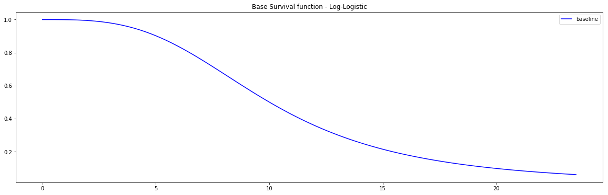

<!-- # Cox Proportional Hazard models-->

<style>
  h1, h2, h3 { color: #04A9F4; }
</style>

# Cox Proportional Hazard model

The Cox Proportional Hazard model (CoxPH) is a semi-parametric model that focuses on modeling the hazard function $h(t, x_i)$, by assuming that its time component $\lambda_0(t)$ and feature component $\eta(\vec{x_i})$ are proportional such that:
\begin{equation*}
h(t, \vec{x_i}) = h_0(t)\eta(\vec{x_i})
\end{equation*}
with:

* $h_0(t)$, is the baseline function, which is usually not specified.

* $\eta(\vec{x_i})$, is the risk function usually expressed via a linear representation such that $\eta(\vec{x_i}) = \exp \left( \sum_{j=1}^p x^i_j\omega_j \right)$. $\omega_j $ are  the coefficients to determine

---

## Instance
To create an instance, use `pysurvival.models.semi_parametric.CoxPHModel`.

---

## Attributes

* `baseline_hazard`: **array-like** -- values of the hazard function when $x \equiv 0$
* `baseline_survival`: **array-like** -- values of the survival function when $x \equiv 0$
* `summary`: **pandas.DataFrame** -- summary of the modeling results
* `times`: **array-like** -- representation of the time axis of the model
* `time_buckets`: **array-like** -- representation of the time axis of the model using time bins, which are represented by $[ t_{k-1}, t_k )$
* `weights`: **array-like** -- model coefficients

---

## Methods

!!! abstract "`fit`  - Fit the estimator based on the given parameters"
    ```
    fit(X, T, E, init_method='glorot_normal', lr = 1e-2, max_iter = 100, l2_reg = 1e-4, alpha = 0.95, tol = 1e-3, epsilon=1e-9, verbose = True, display_loss=True)
    ``` 

    **Parameters:**

    * `X` : **array-like** --
        input samples; where the rows correspond to an individual sample and the columns represent the features *(shape=[n_samples, n_features])*.

    * `T` : **array-like** -- 
        target values describing the time when the event of interest or censoring
        occurred.

    * `E` : **array-like** --
        values that indicate if the event of interest occurred i.e.: E[i]=1
        corresponds to an event, and E[i] = 0 means censoring, for all i.

    * `init_method` : **str** *(default = 'glorot_uniform')* -- 
        initialization method to use. Here are the possible options:

        * `glorot_uniform`: [Glorot/Xavier uniform initializer](http://jmlr.org/proceedings/papers/v9/glorot10a/glorot10a.pdf)
        * `he_uniform`: [He uniform variance scaling initializer](http://arxiv.org/abs/1502.01852)
        * `uniform`: Initializing tensors with uniform (-1, 1) distribution
        * `glorot_normal`: Glorot normal initializer,
        * `he_normal`: He normal initializer.
        * `normal`: Initializing tensors with standard normal distribution
        * `ones`: Initializing tensors to 1
        * `zeros`: Initializing tensors to 0
        * `orthogonal`: Initializing tensors with a orthogonal matrix,
        
    * `lr`: **float** *(default=1e-4)* -- 
        learning rate used in the optimization

    * `max_iter`: **int** *(default=100)* -- 
        maximum number of iterations in the Newton optimization

    * `l2_reg`: **float** *(default=1e-4)* -- 
        L2 regularization parameter for the model coefficients

    * `alpha`: **float** *(default=0.95)* -- 
        confidence level

    * `tol`: **float** *(default=1e-3)* -- 
        tolerance for stopping criteria

    * `verbose`: **bool** *(default=True)* -- 
        whether or not producing detailed logging about the modeling

    **Returns:**

    * `self` : object


!!! abstract "`predict_hazard` - Predicts the hazard function $h(t, x)$"

    ```
    predict_hazard(x, t = None)
    ```

    **Parameters:**

    * `x` : **array-like**  --
        input samples; where the rows correspond to an individual sample and the columns represent the features *(shape=[n_samples, n_features])*.
        x should not be standardized before, the model will take care of it

    * `t`: **double** *(default=None)* --
         time at which the prediction should be performed. 
         If None, then it returns the function for all available t.

    **Returns:**

    * `hazard`: **numpy.ndarray** --
        array-like representing the prediction of the hazard function


!!! abstract "`predict_risk` - Predicts the risk score $r(x)$"

    ```
    predict_risk(x)
    ```

    **Parameters:**

    * `x` : **array-like** --
        input samples; where the rows correspond to an individual sample and the columns represent the features *(shape=[n_samples, n_features])*.
        x should not be standardized before, the model will take care of it

    **Returns:**

    * `risk_score`: **numpy.ndarray** --
        array-like representing the prediction of the risk score


!!! abstract "`predict_survival` - Predicts the survival function $S(t, x)$"

    ```
    predict_survival(x, t = None)
    ```

    **Parameters:**

    * `x` : **array-like** --
        input samples; where the rows correspond to an individual sample and the columns represent the features *(shape=[n_samples, n_features])*.
        x should not be standardized before, the model will take care of it

    * `t`: **double** *(default=None)* --
         time at which the prediction should be performed. 
         If None, then return the function for all available t.

    **Returns:**

    * `survival`: **numpy.ndarray** --
        array-like representing the prediction of the survival function


## Example

Let's now take a look at how to use the Cox PH model on a [simulation dataset generated from a parametric model](simulations.md).

```python
#### 1 - Importing packages
import numpy as np
import pandas as pd
from matplotlib import pyplot as plt
from sklearn.model_selection import train_test_split
from pysurvival.models.simulations import SimulationModel
from pysurvival.models.semi_parametric import CoxPHModel
from pysurvival.utils.metrics import concordance_index
from pysurvival.utils.display import integrated_brier_score
#%pylab inline


#### 2 - Generating the dataset from a Log-Logistic parametric model
# Initializing the simulation model
sim = SimulationModel( survival_distribution = 'log-logistic',  
                       risk_type = 'linear',
                       censored_parameter = 10.1, 
                       alpha = 0.1, beta=3.2 )

# Generating N random samples 
N = 1000
dataset = sim.generate_data(num_samples = N, num_features = 4)

# Showing a few data-points 
dataset.head(2)
```
We can now see an overview of the data:

| x_1       | x_2   | x_3      | x_4  | time | event |
|-----------|-------|----------|------|------|-------|
| 14.711368 | 123.0 | 0.022755 | 114.0| 2.0  | 0.    |
| 14.584616 | 117.0 | 0.011464 | 116.0| 9.0  | 0.    |


Pysurvival also displays the Base Survival function of the Simulation model:
```python
from pysurvival.utils.display import display_baseline_simulations
display_baseline_simulations(sim, figure_size=(20, 6))
```

<center></center>
<center>Figure 1 - Base Survival function of the Simulation model</center>


```python
#### 3 - Creating the modeling dataset
# Defining the features
features = sim.features

# Building training and testing sets #
index_train, index_test = train_test_split( range(N), test_size = 0.2)
data_train = dataset.loc[index_train].reset_index( drop = True )
data_test  = dataset.loc[index_test].reset_index( drop = True )

# Creating the X, T and E input
X_train, X_test = data_train[features], data_test[features]
T_train, T_test = data_train['time'].values, data_test['time'].values
E_train, E_test = data_train['event'].values, data_test['event'].values


#### 4 - Creating an instance of the Cox PH model and fitting the data.
# Building the model
coxph = CoxPHModel()
coxph.fit(X_train, T_train, E_train, lr=0.5, l2_reg=1e-2, init_method='zeros')


#### 5 - Cross Validation / Model Performances
c_index = concordance_index(coxph, X_test, T_test, E_test) #0.92
print('C-index: {:.2f}'.format(c_index))

ibs = integrated_brier_score(coxph, X_test, T_test, E_test, t_max=10, 
            figure_size=(20, 6.5) )
print('IBS: {:.2f}'.format(ibs))
```

We can see that the c-index is well above 0.5 and that the Prediction error curve is below the 0.25 limit, thus the model yields great performances.
<center></center>
<center>Figure 2 - Prediction error curve</center>


We can show this by randomly selecting datapoints and comparing the actual and predicted survival functions, computed by the simulation model and the CoxPH model respectively.
```python
#### 6 - Comparing actual and predictions
# Initializing the figure
fig, ax = plt.subplots(figsize=(8, 4))

# Randomly extracting a data-point that experienced an event 
choices = np.argwhere((E_test==1.)&(T_test>=1)).flatten()
k = np.random.choice( choices, 1)[0]

# Saving the time of event
t = T_test[k]

# Computing the Survival function for all times t
predicted = coxph.predict_survival(X_test.values[k, :]).flatten()
actual = sim.predict_survival(X_test.values[k, :]).flatten()

# Displaying the functions
plt.plot(coxph.times, predicted, color='blue', label='predicted', lw=2)
plt.plot(sim.times, actual, color = 'red', label='actual', lw=2)

# Actual time
plt.axvline(x=t, color='black', ls ='--')
ax.annotate('T={:.1f}'.format(t), xy=(t, 0.5), xytext=(t, 0.5), fontsize=12)

# Show everything
title = "Comparing Survival functions between Actual and Predicted"
plt.legend(fontsize=12)
plt.title(title, fontsize=15)
plt.ylim(0, 1.05)
plt.show()
```

<center></center>
<center>Figure 3 - Comparing Actual vs Predicted</center>
