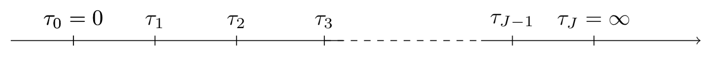

<!-- # MTLR models-->

# Multi-Task Logistic Regression models

When it comes to predicting the survival function for a specific unit, the [Cox Proportional Hazard Model](coxph.md) is usually the go-to model. However, it presents some important drawbacks:

* It relies on the proportional hazard assumption, which specifies that the ratio of the hazards for any two individuals is constant over time.
* The exact formula of the model that can handle ties isn’t computationally efficient, and is often rewritten using approximations, such as the Efron’s or Breslow’s approximations, in order to fit the model in a reasonable time.
* The fact that the time component of the hazard function remains unspecified makes the CoxPH model ill-suited for actual survival function predictions.

The Multi-Task Logistic Regression models were therefore introduced to provide great alternatives.

---

## [Linear MTLR model](linear_mtlr.md)

The [Multi-Task Logistic Regression (MTLR) model created by Yu, Chun-Nam, et al. in 2011 ](http://www.cs.cornell.edu/~cnyu/papers/nips11_survival.pdf) can be seen as a series of logistic regression models built on different time intervals so as to estimate the probability that the event of interest happened within each interval.

The model can be built using the following steps:

1. We start by dividing the time axis into $J$ time intervals such that $\forall j \in [\![1, J ]\!]$, $ a_j = [ \tau_{j-1}, \tau_j )$ with $ \tau_0 = 0 $ and $\tau_J = \infty$.

Figure 1 - Subdivisions of the time axis in J intervals

2. We then build a logistic regression model on each interval $a_j$, with the parameters $\left( \vec{\theta_j}, b_j \right)$  and the response variable 
\begin{equation}
y_j  = 
                 \begin{cases}
                 1 \text{    , if } T \in a_j \text{ i.e., the event happened in the interval } a_j \\
                 0 \text{    , otherwise} \\
                    \end{cases}
\end{equation}
But, because we are not analyzing the effects of recurrent events, we need to make sure that when a unit experiences an event on interval $a_s$ with $s \in [\![1, J ]\!]$, its status for the remaining intervals stays the same. Thus, the response vector **${Y}$** is:
\begin{equation*}
 \vec{Y} =  \begin{bmatrix}y_1 = 0 \\  y_2 = 0 \\ \vdots \\ y_{s-1} = 0 \\  y_{s} = 1 \\  \vdots  \\  y_{J} =1 \end{bmatrix}
\end{equation*}
Chun-Nam Yu et al. proposed the following definitions for the density and survival functions:

    * *Density function*:
      \begin{equation}
       \tag{MTLR - density}
      \begin{split}
    f(a_s,  \vec{x}) & = P\left[  T \in [\tau_{s-1}, \tau_s) | \vec{x} \right]  \\
        & = \frac{\exp\left(   \sum_{j = s}^{J-1} \vec{x} \cdot \vec{\theta}_j + b_j \right) }{ Z(\vec{x}) } \\
        & = \frac{\exp\left(  \left(\vec{x} \cdot \textbf{$\Theta$} + \vec{b} \right)\cdot \textbf{$\Delta$}  \right) \circ \vec{Y}  }{ Z(\vec{x}) } 
    \end{split}
      \end{equation}
      
    * *Survival function*:
       \begin{equation}
       \tag{MTLR - survival}
        \begin{split}
    S(\tau_{s-1}, \vec{x})  = P\left[  T \geq \tau_{s-1}|\vec{x} \right ]  & =  \sum^{J}_{k = s} P\left[  T \in [\tau_{k-1}, \tau_k) | \vec{x} \right ]  \\
     & =  \sum^{J}_{k = s} \frac{ \exp \left(   \sum^{J-1}_{j=s} (\vec{x} \cdot \vec{ \theta}_j + b_j) \right) }{  Z(  \vec{x})}    \\
     & =  \sum^{J}_{k = s} \frac{ \exp \left(  \left(  \vec{x} \cdot \textbf{$\Theta$} + \vec{b} \right) \cdot \textbf{$\Delta$} \right) \circ \vec{Y} }{  Z\left(  \vec{x}\right)}   
    \end{split}
      \end{equation}

    with:

    * $ \circ $, the [Hadamard product](https://en.wikipedia.org/wiki/Hadamard_product_(matrices))
    * the coefficients matrix, $$\displaystyle \Theta =  \begin{bmatrix} \theta_{1, 1} & \theta_{1, 2}  & ... &  \theta_{1, J-1}&  \theta_{1, J} \\   
                                           \theta_{2, 1} & \theta_{2, 2}  & ... &  \theta_{2, J-1}&  \theta_{2, J} \\  
                                           ...   &   ...  & ... & ...  & ...  \\
                                           \theta_{p, 1} & \theta_{p, 2} & ... &  \theta_{p, J-1}& \theta_{p, J} \\  
                          \end{bmatrix} 
                         = \left[\vec{\theta}_1,  \vec{\theta}_2, ...,    \vec{\theta}_{J-1},  \vec{\theta}_J \right]$$

    * the bias vector: $$ \vec{b} = \begin{bmatrix} b_1, & b_2,   & ... &  b_{J-1}, &  b_J \end{bmatrix}$$

    * the $(J \times J+1)$-triangular matrix: $$\Delta = \begin{bmatrix} 1 & 0 & 0 & ... & 0 & 0 \\  
                                                          1 & 1  & 0 & ... & 0 & 0 \\
                                                          \vdots  & \vdots  &  \vdots  &... &   \vdots & \vdots   \\
                                                          1 & 1  & 1 & ... & 0 & 0 \\  
                                                          1 & 1  & 1 & ... & 1 & 0 \\  
                                          \end{bmatrix} $$

    * the normalization constant $$Z \left(  \vec{x}\right) = \sum_{j=1}^J \exp \left( \sum_{l=j+1}^J \vec{\theta}_l  \cdot \vec{x} + b_l\right)$$

3. We can therefore compute the loss function and minimize it to find the optimal model parameters.

    \begin{equation*}
        l(\Theta, b) = \sum_{i=1}^N \delta_i \log\left(f(a_s,  \vec{x_i}) \right) + (1-\delta_i)\log\left( S(\tau_{s-1}, \vec{x_i}) \right) + \alpha_{l2}\left(|| \Theta ||^2 + || b ||^2 \right)
    \end{equation*}

---

## [Neural MTLR model](neural_mtlr.md)

Although the MTLR model provides similar results as the CoxPH model without having to rely on the assumptions required by the latter, at its core, it is still powered by a linear transformation. Thus, in the presence of nonlinear elements in the data, it will stop yielding satisfactory performances. The [Neural Multi-Task Logistic Regression (N-MTLR)](https://arxiv.org/pdf/1801.05512) which allows the use of Neural Networks within the original MTLR design, will help solve this issue.

In the case of Neural Multi-Task Logistic Regression, the density and survival functions become:

* *Density function*:
\begin{equation}
\tag{N-MTLR - density}
\begin{split}
f(a_s, \vec{x}) = P\left[  T \in [\tau_{s-1}, \tau_s) | \vec{x} \right ]  & =   \frac{ \exp \left(  \psi( \vec{x})  \cdot \textbf{$\Delta$}  \right)  \circ  \vec{Y} }{ Z\left( \psi( \vec{x})\right) }
\end{split}
\end{equation}

* *Survival function*:
\begin{equation}
\tag{N-MTLR - survival}
\begin{split}
S(\tau_{s-1}, \vec{x})  =   \sum^{J}_{k = s} \frac{ \exp \left(   \psi( \vec{x})  \cdot  \textbf{$\Delta$}  \right) \circ  \vec{Y} }{ Z\left( \psi( \vec{x})\right) }   
\end{split}
\end{equation}

with $  \psi: \mathbb{R}^p \mapsto \mathbb{R}^{J} $ is the nonlinear transformation using $\vec{x} \in  \mathbb{R}^{p}$ feature vector as its input. Its output is a $\mathbb{R}^{J}$ vector whose values are mapped to the $J$ subdivisions of the time axis

Figure 2 - Representation of a 2-hidden layer transformation

---

## References
* ["Learning patient-specific cancer survival distributions as a sequence of dependent regressors." Yu, Chun-Nam, et al. Advances in Neural Information Processing Systems. 2011.](http://papers.nips.cc/paper/4210-learning-patient-specific-cancer-survival-distributions-as-a-sequence-of-dependent-regressors.pdf)
* ["Deep Neural Networks for Survival Analysis Based on a Multi-Task Framework." Fotso, S. (2018). arXiv:1801.05512.](https://arxiv.org/abs/1801.05512)
* [Square's Technical Blog - Deep Learning + Survival Analysis: Our Approach to Multi-Task Frameworks](https://medium.com/square-corner-blog/deep-neural-networks-for-survival-analysis-based-on-a-multi-task-framework-ded8697be85c)