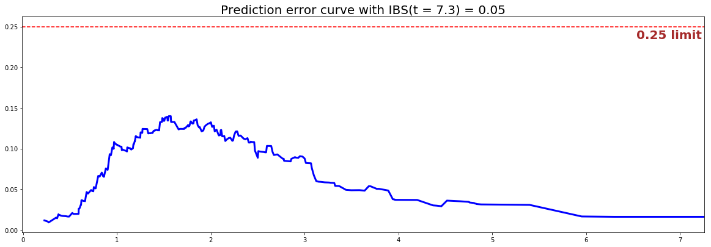

<!-- # Semi-parametric models-->

<style>
  h1, h2, h3 { color: #04A9F4; }
</style>

#  DeepSurv/Non-Linear model

The NonLinear CoxPH model was popularized by Katzman et al. in **[DeepSurv: Personalized Treatment Recommender System Using A Cox Proportional Hazards Deep Neural Network](https://arxiv.org/pdf/1606.00931.pdf)** by allowing the use of Neural Networks within the original design and therefore introducing more modeling flexibility. 

---

## Instance
To create an instance, use `pysurvival.models.semi_parametric.NonLinearCoxPHModel`.

---

## Attributes

* `baseline_hazard`: **array-like** -- values of the hazard function when $x \equiv 0$
* `baseline_survival`: **array-like** -- values of the survival function when $x \equiv 0$
* `structure`: **list of dictionaries** -- Provides the structure of the MLP within the model
* `times`: **array-like** -- representation of the time axis of the model
* `time_buckets`: **array-like** -- representation of the time axis of the model using time bins, which are represented by $[ t_{k-1}, t_k )$


---

## Methods

!!! abstract " `__init__` - Initialization "

    ```
    NonLinearCoxPH(structure, auto_scaler=True)
    ```

    **Parameters:**
     
    * `structure`:  **list of dictionaries** -- 
        Provides the structure of the MLP within the model.
        
        ex: `structure = [ {'activation': 'ReLU', 'num_units': 128}, 
                           {'activation': 'Tanh', 'num_units': 128}, ]`.

        Each dictionary corresponds to a fully connected hidden layer:

        * `num_units` is the number of hidden units in this layer
        * `activation` is the activation function that will be used. The list of all available activation functions can be found [here](../miscellaneous/activation_functions.md).
        
        In case there are more than one dictionary, each hidden layer will be applied in the resulting MLP, using the order it is provided in the structure .

    * `auto_scaler`: **boolean** *(default=True)* -- 
        Determines whether a sklearn scaler should be automatically applied

    
!!! abstract " `fit` - Fit the estimator based on the given parameters"

    ```
    fit(X, T, E, init_method = 'glorot_uniform', optimizer ='adam', 
        lr = 1e-4, num_epochs = 1000, dropout = 0.2, l2_smooth=1e-2, 
        batch_normalization=False, bn_and_dropout=False,
        display_loss = True, verbose=True, extra_pct_time = 0.1)
    ```

    **Parameters:**

    * `X` : **array-like** --
        input samples; where the rows correspond to an individual sample and the columns represent the features *(shape=[n_samples, n_features])*.

    * `T` : **array-like** -- 
        target values describing the time when the event of interest or censoring
        occurred.

    * `E` : **array-like** --
        values that indicate if the event of interest occurred i.e.: E[i]=1
        corresponds to an event, and E[i] = 0 means censoring, for all i.

    * `init_method` : **str** *(default = 'glorot_uniform')* -- 
        Initialization method to use. Here are the possible options:

        * `glorot_uniform`: [Glorot/Xavier uniform initializer](http://jmlr.org/proceedings/papers/v9/glorot10a/glorot10a.pdf)
        * `he_uniform`: [He uniform variance scaling initializer](http://arxiv.org/abs/1502.01852)
        * `uniform`: Initializing tensors with uniform (-1, 1) distribution
        * `glorot_normal`: Glorot normal initializer,
        * `he_normal`: He normal initializer.
        * `normal`: Initializing tensors with standard normal distribution
        * `ones`: Initializing tensors to 1
        * `zeros`: Initializing tensors to 0
        * `orthogonal`: Initializing tensors with a orthogonal matrix,

    * `optimizer`:  **str** *(default = 'adam')* -- 
        iterative method for optimizing a differentiable objective function.
        Here are the possible options:

        - `adadelta`
        - `adagrad`
        - `adam`
        - `adamax`
        - `rmsprop`
        - `sparseadam`
        - `sgd`

    * `lr`: **float** *(default=1e-4)* -- 
        learning rate used in the optimization

    * `num_epochs`: **int** *(default=1000)* -- 
        number of iterations in the optimization

    * `dropout`: **float** *(default=0.5)* -- 
        randomly setting a fraction rate of input units to 0 
        at each update during training time, which helps prevent overfitting.

    * `l2_reg`: **float** *(default=1e-4)* -- 
        L2 regularization parameter for the model coefficients

    * `batch_normalization`: **bool** *(default=True)* -- 
        whether or not applying Batch Normalization or not

    * `bn_and_dropout`: **bool** *(default=False)* -- 
        whether or not applying Batch Normalization and Dropout at the same time

    * `verbose`: **bool** *(default=True)* -- 
        whether or not producing detailed logging about the modeling

    **Returns:**

    * self : object


!!! abstract "`predict_hazard` - Predicts the hazard function $h(t, x)$"

    ```
    predict_hazard(x, t = None)
    ```

    **Parameters:**

    * `x` : **array-like**  --
        input samples; where the rows correspond to an individual sample and the columns represent the features *(shape=[n_samples, n_features])*.
        x should not be standardized before, the model will take care of it

    * `t`: **double** *(default=None)* --
         time at which the prediction should be performed. 
         If None, then it returns the function for all available t.

    **Returns:**

    * `hazard`: **numpy.ndarray** --
        array-like representing the prediction of the hazard function


!!! abstract "`predict_risk` - Predicts the risk score $r(x)$"

    ```
    predict_risk(x)
    ```

    **Parameters:**

    * `x` : **array-like** --
        input samples; where the rows correspond to an individual sample and the columns represent the features *(shape=[n_samples, n_features])*.
        x should not be standardized before, the model will take care of it

    **Returns:**

    * `risk_score`: **numpy.ndarray** --
        array-like representing the prediction of the risk score


!!! abstract "`predict_survival` - Predicts the survival function $S(t, x)$"

    ```
    predict_survival(x, t = None)
    ```

    **Parameters:**

    * `x` : **array-like** --
        input samples; where the rows correspond to an individual sample and the columns represent the features *(shape=[n_samples, n_features])*.
        x should not be standardized before, the model will take care of it

    * `t`: **double** *(default=None)* --
         time at which the prediction should be performed. 
         If None, then return the function for all available t.

    **Returns:**

    * `survival`: **numpy.ndarray** --
        array-like representing the prediction of the survival function


---


## Example

Let's now take a look at how to use the NonLinear CoxPH model on a [simulation dataset generated from a parametric model](simulations.md).

```python
#### 1 - Importing packages
import numpy as np
import pandas as pd
from matplotlib import pyplot as plt
from sklearn.model_selection import train_test_split
from pysurvival.models.simulations import SimulationModel
from pysurvival.models.semi_parametric import NonLinearCoxPHModel
from pysurvival.utils.metrics import concordance_index
from pysurvival.utils.display import integrated_brier_score
#%pylab inline

#### 2 - Generating the dataset from a nonlinear Weibull parametric model
# Initializing the simulation model
sim = SimulationModel( survival_distribution = 'weibull',  
                       risk_type = 'gaussian',
                       censored_parameter = 2.1, 
                       alpha = 0.1, beta=3.2 )

# Generating N random samples 
N = 1000
dataset = sim.generate_data(num_samples = N, num_features=3)

# Showing a few data-points 
dataset.head(2)
```
We can now see an overview of the data:

| x_1        | x_2      | x_3       | time     | event|
|------------|----------|-----------|----------|------|
| -13.851194 | 0.324245 | -0.153511 | 1.925692 | 1.   |
| -0.094204  | 0.050048 | -0.214262 | 0.000000 | 0.   |

pySurvival also displays the Base Survival function of the Simulation model:
```python
from pysurvival.utils.display import display_baseline_simulations
display_baseline_simulations(sim, figure_size=(10, 5))
```

<center></center>
<center>Figure 1 - Base Survival function of the Simulation model</center>


```python
#### 3 - Creating the modeling dataset
# Defining the features
features = sim.features

# Building training and testing sets #
index_train, index_test = train_test_split( range(N), test_size = 0.2)
data_train = dataset.loc[index_train].reset_index( drop = True )
data_test  = dataset.loc[index_test].reset_index( drop = True )

# Creating the X, T and E input
X_train, X_test = data_train[features], data_test[features]
T_train, T_test = data_train['time'].values, data_test['time'].values
E_train, E_test = data_train['event'].values, data_test['event'].values


#### 4 - Creating an instance of the NonLinear CoxPH model and fitting the data.

# Defining the MLP structure. Here we will build a 1-hidden layer 
# with 150 units and `BentIdentity` as its activation function
structure = [ {'activation': 'BentIdentity', 'num_units': 150},  ]

# Building the model
nonlinear_coxph = NonLinearCoxPHModel(structure=structure) 
nonlinear_coxph.fit(X_train, T_train, E_train, lr=1e-3, init_method='xav_uniform')


#### 5 - Cross Validation / Model Performances
c_index = concordance_index(nonlinear_coxph, X_test, T_test, E_test) #0.81
print('C-index: {:.2f}'.format(c_index))

ibs = integrated_brier_score(nonlinear_coxph, X_test, T_test, E_test, t_max=10, 
            figure_size=(20, 6.5) )
print('IBS: {:.2f}'.format(ibs))
```

We can see that the c-index is well above 0.5 and that the Prediction error curve is below the 0.25 limit, thus the model yields great performances. thus the model is likely to yield great performances.
<center></center>
<center>Figure 2 - Prediction error curve</center>


We can show this by randomly selecting datapoints and comparing the actual and predicted survival functions, computed by the simulation model and the Nonlinear CoxPH respectively. 

```python
#### 6 - Comparing actual and predictions
# Initializing the figure
fig, ax = plt.subplots(figsize=(8, 4))

# Randomly extracting a data-point that experienced an event 
choices = np.argwhere((E_test==1.)&(T_test>=1)).flatten()
k = np.random.choice( choices, 1)[0]

# Saving the time of event
t = T_test[k]

# Computing the Survival function for all times t
predicted = nonlinear_coxph.predict_survival(X_test.values[k, :]).flatten()
actual = sim.predict_survival(X_test.values[k, :]).flatten()


# Displaying the functions
plt.plot(nonlinear_coxph.times, predicted, color='blue', label='predicted', lw=2)
plt.plot(sim.times, actual, color = 'red', label='actual', lw=2)

# Actual time
plt.axvline(x=t, color='black', ls ='--')
ax.annotate('T={:.1f}'.format(t), xy=(t, 0.5), xytext=(t, 0.5), fontsize=12)

# Show everything
title = "Comparing Survival functions between Actual and Predicted"
plt.legend(fontsize=12)
plt.title(title, fontsize=15)
plt.ylim(0, 1.05)
plt.show()
```

<center></center>
<center>Figure 3 - Comparing Actual and Predicted survival functions</center>

