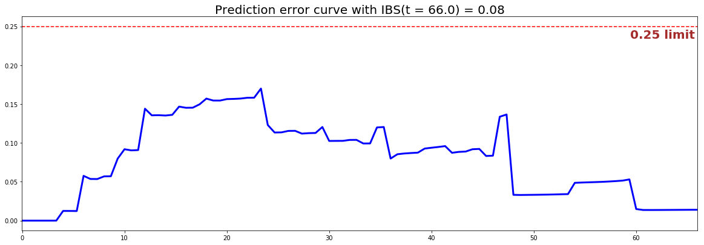

<!--  Tutorial - Credit Risk -->
<style>
  h1, h2, h3, h4 { color: #04A9F4; }
</style>


# Computing the speed of repayment of loans

## 1 - Introduction

Credit Risk refers to the likelihood that a borrower will not be able to repay a loan contracted by a lender. Thus throughout the years, financial institutions have developed various ways to quantify that risk so as to limit their exposure.

Here, instead of simply modeling whether a borrower will repay, by using Survival Analysis, it becomes possible to determine when this will happen. Indeed, it is easy to consider that fully repaying a loan is an **explicit event**, and therefore not having paid back the loan yet can be defined as the censored situation.

By using this configuration, banks, credit unions, or fintech startups in the lending space can predict the speed of repayment of a loan. This will help these institutions mitigate losses due to bad debt, customize interest rates, improve cash flow and credit collections, and determine which customers are likely to bring in the most revenue throughout a variety of products.

---

## 2 - Set up

In this tutorial, we will be using the German Credit dataset, which was originally provided by Professor Dr. Hans Hofmann of the University of Hamburg and available on the [UCI Machine Learning Repository](https://archive.ics.uci.edu/ml/datasets/statlog+(german+credit+data)). The current version was adapted to be directly usable with a minimum amount of feature transformation..

## 3 - Dataset

### 3.1 - Overview
The dataset contains information useful to assess the borrowers creditworthiness as well as socio-demographic elements:

|     Feature category                    | Feature name              | Type        |  Description        |
|-----------------------------------------|---------------------------|-------------|---------------------|
| <span style="color:blue"> Time </span>  | `duration`                | numerical   | Duration in month |
| <span style="color:blue"> Event </span> | `full_repaid`             | categorical | Specifies if the loan was fully repaid |
| Socio-Demographic                       | `age`                     | numerical   | Age of the borrower (in years)|
| Socio-Demographic                       | `foreign_worker`          | numerical   | Indicates if the borrower is a foreign worker |
| Socio-Demographic                       | `personal_status`         | categorical | Gender and Marital status |
| Socio-Demographic                       | `people_liable`           | numerical   | Number of people being liable to provide maintenance for  |
| Socio-Demographic                       | `telephone`               | numerical   | Indicates if the borrower owns a phone |
| Employment                              | `employment_years`        | categorical | Years of employment at current job |
| Employment                              | `job`                     | categorical | Employment status |
| Residence                               | `housing`                 | categorical | Residential status of the borrower |
| Residence                               | `present_residence`       | numerical   | Years living at current residence |
| Loan information                        | `amount`                  | numerical   | Amount of money borrowed|
| Loan information                        | `installment_rate`        | numerical   | Percentage of amount borrowed that will be charged by a lender to a borrower. |
| Loan information                        | `purpose`                 | categorical | Reason to get a loan|
| Bank information                        | `checking_account_status` | categorical | Status of the checking account |
| Bank information                        | `credit_history`          | categorical | Credit history of the borrower|
| Bank information                        | `number_of_credits`       | numerical   | Number of existing credits at this bank |
| Bank information                        | `other_installment_plans` | categorical | Type of installments plans the borrower already has |
| Bank information                        | `savings_account_status`  | categorical | Status of the saving account |
| Collateral/Guarantor                    | `property`                | categorical | Type of valuable assets the borrower owns |
| Collateral/Guarantor                    | `other_debtors`           | categorical | Indicate if someone else will be involved in the repayment or is guaranteeing the loan |

```python
# Importing modules
import pandas as pd
import numpy as np
from matplotlib import pyplot as plt
from pysurvival.datasets import Dataset
%pylab inline  

# Reading the dataset
raw_dataset = Dataset('credit_risk').load()
print("The raw_dataset has the following shape: {}.".format(raw_dataset.shape))
raw_dataset.head(3)
```
Here is an overview of the raw dataset:

| checking_account_status | duration | credit_history      | ... | foreign_worker | full_repaid  |
|-------------------------|----------|---------------------|-----|----------------|--------------|
| below_0                 | 6        | critical_account    | ... | 1              | 1            |
| 0_to_200                | 48       | existing_credit_paid| ... | 1              | 0            |
| no_account              | 12       | critical_account    | ... | 1              | 1            |


### 3.2 - From categorical to numerical
There are several categorical features that need to encoded into one-hot vectors:

```python
# From category to numerical
category_columns = [
    'checking_account_status', 'credit_history', 'purpose', 
    'savings_account_status', 'employment_years', 'personal_status', 
    'other_debtors', 'property', 'other_installment_plans', 'housing', 'job']
dataset = pd.get_dummies(raw_dataset, columns=category_columns, drop_first=True)

# Creating the time and event columns
time_column = 'duration'
event_column = 'full_repaid' 

# Creating the features
features = np.setdiff1d(dataset.columns, [time_column, event_column] ).tolist()
```

---

## 4 - Exploratory Data Analysis

As this tutorial is mainly designed to provide an example of how to use PySurvival, we will not do a thorough exploratory data analysis here but greatly encourage the reader to do so by checking the [predictive maintenance tutorial that provides a detailed analysis.](maintenance.md#4-exploratory-data-analysis)

Here, we will just check if the dataset contains Null values or if it has duplicated rows. Then, we will take a look at feature correlations.

### 4.1 - Null values and duplicates
The first thing to do is checking if the raw_dataset contains Null values and has duplicated rows.
```python
# Checking for null values
N_null = sum(dataset[features].isnull().sum())
print("The raw_dataset contains {} null values".format(N_null)) #0 null values

# Removing duplicates if there exist
N_dupli = sum(dataset.duplicated(keep='first'))
dataset = dataset.drop_duplicates(keep='first').reset_index(drop=True)
print("The raw_dataset contains {} duplicates".format(N_dupli))

# Number of samples in the dataset
N = dataset.shape[0]
```
As it turns out the raw_dataset doesn't have any Null values or duplicates.


### 4.2 - Correlations
Let's compute and visualize the correlation between the features
```python
from pysurvival.utils.display import correlation_matrix
correlation_matrix(dataset[features], figure_size=(40,15), text_fontsize=7)
```

<center></center>
<center>Figure 1 - Correlations </center>

Based on the correlations chart, we should remove the following features

* `credit_history_existing_credit_paid`
* `housing_own`

```python
to_remove = ['credit_history_existing_credit_paid', 'housing_own']
features = np.setdiff1d(features, to_remove).tolist()
```

---

## 5 - Modeling
So as to perform cross-validation later on and assess the performances of the model, let's split the dataset into training and testing sets.
```python
# Building training and testing sets
from sklearn.model_selection import train_test_split
index_train, index_test = train_test_split( range(N), test_size = 0.4)
data_train = dataset.loc[index_train].reset_index( drop = True )
data_test  = dataset.loc[index_test].reset_index( drop = True )

# Creating the X, T and E inputs
X_train, X_test = data_train[features], data_test[features]
T_train, T_test = data_train[time_column], data_test[time_column]
E_train, E_test = data_train[event_column], data_test[event_column]
```

Let's now fit a [Neural MTLR](../models/neural_mtlr.md) model to the training set. 

*Note: The choice of the structure of the neural network was obtained using grid-search hyperparameters selection, not displayed in this tutorial.*
```python
from pysurvival.models.multi_task import NeuralMultiTaskModel

# Initializing the Neural MTLR with a time axis split into 100 intervals
structure = [ 
                {'activation': 'ReLU', 'num_units': 60}, 
                {'activation': 'Swish', 'num_units': 60}, 
            ] 
neural_mtlr = NeuralMultiTaskModel(bins=100, structure=structure)

# Fitting the model
neural_mtlr.fit(X_train, T_train, E_train, 
                init_method = 'orthogonal', optimizer ='rprop', lr = 1e-4, 
                l2_reg = 1e-1,  l2_smooth = 1e-1,
                batch_normalization = True,  bn_and_dropout = True,
                dropout=0.5,  num_epochs = 500)
```

We can take a look at the values of N-MTLR loss function to ensure that the fitting isn't incomplete
```python
from pysurvival.utils.display import display_loss_values
display_loss_values(neural_mtlr)
```
<center></center>
<center>Figure 2 - Neural MTLR loss function values </center>

---

## 6 - Cross Validation
In order to assess the model performance, we previously split the original dataset into training and testing sets, so that we can now compute its performance metrics on the testing set:

### 6.1 - [C-index](../metrics/c_index.md)
The [C-index](../metrics/c_index.md) represents the global assessment of the model discrimination power: ***this is the model’s ability to correctly provide a reliable ranking of the survival times based on the individual risk scores***. In general, when the C-index is close to 1, the model has an almost perfect discriminatory power; but if it is close to 0.5, it has no ability to discriminate between low and high risk subjects.

```python
from pysurvival.utils.metrics import concordance_index
c_index = concordance_index(neural_mtlr, X_test, T_test, E_test)
print('C-index: {:.2f}'.format(c_index)) #0.76
```

---

### 6.2 - [Brier Score](../metrics/brier_score.md)

The ***[Brier score](../metrics/brier_score.md) measures the average discrepancies between the status and the estimated probabilities at a given time.***
Thus, the lower the score (*usually below 0.25*), the better the predictive performance. To assess the overall error measure across multiple time points, the Integrated Brier Score (IBS) is usually computed as well.

```python
from pysurvival.utils.display import integrated_brier_score
integrated_brier_score(neural_mtlr, X_test, T_test, E_test, t_max=100, 
                       figure_size=(20, 6.5) ) #0.08
```

<center></center>
<center>Figure 3 - Neural MTLR loss function values </center>


The IBS is equal to $0.08$ on the entire model time axis. This indicates that the model will have good predictive abilities.

---


## 7 - Predictions

### 7.1 - Overall predictions
Now that we have built a model that seems to provide great performances, let's compare the following:

* the time series of the actual and predicted number of loans that were fully repaid, for each time t.
```python
from pysurvival.utils.display import compare_to_actual
results = compare_to_actual(neural_mtlr, X_test, T_test, E_test,
                            is_at_risk = False,  figure_size=(16, 6), 
                            metrics = ['rmse', 'mean', 'median'])
```

<center></center>
<center>Figure 4 - Actual vs Predicted - Number of loans that were fully repaid</center>


* the time series of the actual and predicted number of loans that were still active, for each time t.
```python
results = compare_to_actual(neural_mtlr, X_test, T_test, E_test,
                            is_at_risk = True,  figure_size=(16, 6), 
                            metrics = ['rmse', 'mean', 'median'])
```

<center></center>
<center>Figure 5 - Actual vs Predicted - Number of loans that were still active</center>

Both comparisons show that the model do a great job predicting the number of loans that were fully repaid (*average absolute error of 4.5 loan*) or that were still active (*average absolute error of 18.4 loans*) for all times t of the 70+ months time window.

---


### 7.2 - Individual predictions
Now that we know that we can provide reliable predictions for an entire cohort, let's compute the speed of repayment at the individual level. The speed of repayment is given by $\text{Speed}(t) = 1 - \text{Survival}(t)$

First, we can construct the risk groups based on risk scores distribution. The helper function `create_risk_groups`, which can be found in `pysurvival.utils`, will help us do that:
```python
from pysurvival.utils.display import create_risk_groups

risk_groups = create_risk_groups(model=neural_mtlr, X=X_test, 
    use_log = True, num_bins=30, figure_size=(20, 4),
    low= {'lower_bound':0, 'upper_bound':1.64, 'color':'red'}, 
    medium= {'lower_bound': 1.64, 'upper_bound':1.8, 'color':'green'},
    high= {'lower_bound':1.8, 'upper_bound':3, 'color':'blue'}
    )
```

<center></center>
<center>Figure 6 - Creating risk groups </center>

*Note: The current choice of the lower and upper bounds for each group is based on my intuition; so feel free to change the values so as to match your situation instead.*

Here, it is possible to distinguish 3 main groups, *low*, *medium* and *high* risk groups. Because the C-index is high, the model will be able to  rank the survival times of a random unit of each group, such that $ t_{high}  \leq t_{medium} \leq t_{low}$.

Let's randomly select individual unit in each group and compare their speed of repayment functions. To demonstrate our point, we will purposely select units which experienced an event to visualize the actual time of event.
```python
# Initializing the figure
fig, ax = plt.subplots(figsize=(15, 5))

# Selecting a random individual that experienced an event from each group
groups = []
for i, (label, (color, indexes)) in enumerate(risk_groups.items()) :

    # Selecting the individuals that belong to this group
    if len(indexes) == 0 :
        continue
    X = X_test.values[indexes, :]
    T = T_test.values[indexes]
    E = E_test.values[indexes]

    # Randomly extracting an individual that experienced an event
    choices = np.argwhere((E==1.)).flatten()
    if len(choices) == 0 :
        continue
    k = np.random.choice( choices, 1)[0]
    
    # Saving the time of event
    t = T[k]

    # Computing the CDF for all times t
    cdf = 1. - neural_mtlr.predict_survival(X[k, :]).flatten()

    # Displaying the functions
    label_ = '{} risk'.format(label)
    plt.plot(neural_mtlr.times, cdf, color = color, label=label_, lw=2)
    groups.append(label)

    # Actual time
    plt.axvline(x=t, color=color, ls ='--')
    ax.annotate('T={:.1f}'.format(t), xy=(t, 0.5*(1.+0.2*i)), 
        xytext=(t, 0.5*(1.+0.2*i)), fontsize=12)

# Show everything
groups_str = ', '.join(groups)
title = "Comparing cumulative density functions between {} risk grades"
title = title.format(groups_str)
plt.legend(fontsize=12)
plt.title(title, fontsize=15)
plt.xlim(0, 65)
plt.ylim(0, 1.05)
plt.show()
```

<center></center>
<center>Figure 7 - Predicting individual speed of repayment functions </center>


As we can see, the model manages to perfectly predict the event time, here it corresponds to a sudden increase in the individual speed of repayment function.


---

## 8 - Conclusion
We can now save our model so as to put it in production and score future borrowers.
```python 
# Let's now save our model
from pysurvival.utils import save_model
save_model(neural_mtlr, '/Users/xxx/Desktop/credit_neural_mtlr.zip')
```

Thanks to Survival Analysis, we can see that it is indeed possible to predict the speed of repayment of loans and forecast the number of loans that will be fully repaid throughout time, which is a great advantage over classification modeling.

---

## References

* [German Credit dataset - UCI Machine Learning Repository](https://archive.ics.uci.edu/ml/datasets/statlog+(german+credit+data))
