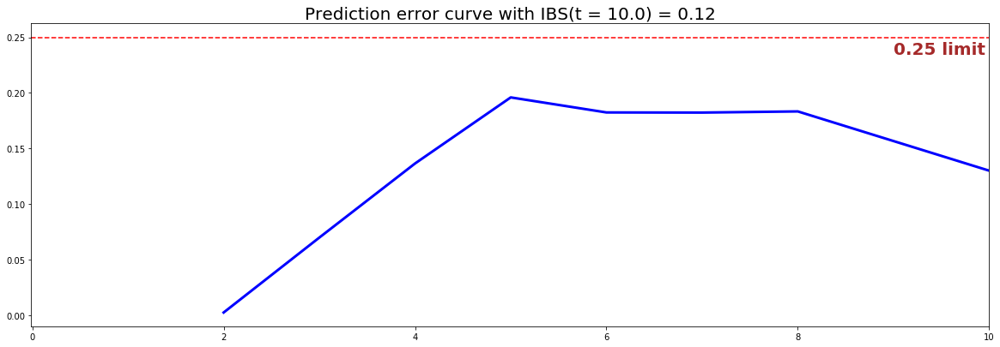

<!--  Tutorial - Employee retention -->
<style>
  h1, h2, h3, h4 { color: #04A9F4; }
</style>

# Knowing when your employees will quit

## 1 - Introduction

Employees attrition can be very costly for companies: reports show that it costs employers [33% of an employee's annual salary to hire a replacement](https://www.benefitnews.com/news/avoidable-turnover-costing-employers-big) if that worker leaves. Moreover, it can jeopardize productivity, cause loss of knowledge and curb staff morale. 

Thus, providing solutions that could predict employee turnover could be greatly beneficial for companies. Furthermore, by using Survival Analysis and taking into account the time dimension, predicting when an employee will quit becomes possible.

---

## 2 - Dataset

In this tutorial, we will use the human resources dataset [Employee Attrition dataset](https://github.com/ludovicbenistant/Management-Analytics/blob/master/HR/HR.csv) to demonstrate the usefulness of Survival Analysis. 

### 2.1 - Overview
Here, we will consider the following features:

|     Feature category                    | Feature name              | Type        |  Description        |
|-----------------------------------------|---------------------------|-------------|---------------------|
| <span style="color:blue"> Time </span>  | `time_spend_company`      | numerical   | Time spent at the company |
| <span style="color:blue"> Event </span> | `left`                    | categorical | Specifies if the employee left the company|
| Evaluation/Scoring                      | `satisfaction`            | numerical   | Employee satisfaction level |
| Evaluation/Scoring                      | `last_evaluation`         | numerical   | Last evaluation score |
| Day-to-Day activities                   | `number_projects`         | numerical   | Number of projects assigned to the employee |
| Day-to-Day activities                   | `average_monthly_hour`    | numerical   | Average monthly hours worked |
| Day-to-Day activities                   | `work_accident`           | numerical   | Whether the employee has had a work accident|
| Department                              | `department`              | categorical | Department name/Specialized functional area within the company|
| Salary                                  | `salary`                  | categorical | Salary category|

```python
# Importing modules
import pandas as pd
import numpy as np
from matplotlib import pyplot as plt
from pysurvival.datasets import Dataset
%pylab inline  

# Reading the dataset
raw_dataset = Dataset('employee_attrition').load()
print("The raw_dataset has the following shape: {}.".format(raw_dataset.shape))
raw_dataset.head(3)
```

Here is an overview of the raw dataset:

| satisfaction_level | last_evaluation | number_projects| ... | department | salary  |
|--------------------|-----------------|----------------|-----|------------|---------|
| 0.38               | 0.53            | 2    			| ... | sales      | low     |
| 0.80               | 0.86            | 5    			| ... | sales      | medium  |
| 0.11               | 0.88            | 7    			| ... | sales      | medium  |


### 2.2 - From categorical to numerical

Let's encode the categorical features into one-hot vectors and define the modeling features:

```python
# Creating the time and event columns
time_column = 'time_spend_company'
event_column = 'left' 

# Creating one-hot vectors
category_columns = ['department', 'salary']
dataset = pd.get_dummies(raw_dataset, columns=category_columns, drop_first=True)
dataset.head()

# Creating the features
features = np.setdiff1d(dataset.columns, [time_column, event_column] ).tolist()
```

---

## 3 - Exploratory Data Analysis

As this tutorial is mainly designed to provide an example of how to use PySurvival, we will not do a thorough exploratory data analysis here but greatly encourage the reader to do so by checking the [predictive maintenance tutorial that provides a detailed analysis.](maintenance.md#4-exploratory-data-analysis)

Here, we will just check if the dataset contains Null values or if it has duplicated rows. Then, we will take a look at feature correlations.

### 3.1 - Null values and duplicates
The first thing to do is checking if the dataset contains Null values and has duplicated rows.
```python
# Checking for null values
N_null = sum(dataset[features].isnull().sum())
print("The dataset contains {} null values".format(N_null)) #0 null values

# Removing duplicates if there exist
N_dupli = sum(dataset.duplicated(keep='first'))
dataset = dataset.drop_duplicates(keep='first').reset_index(drop=True)
print("The dataset contains {} duplicates".format(N_dupli))

# Number of samples in the dataset
N = dataset.shape[0]
```
As it turns out the dataset doesn't have any Null values but had 3,008 duplicated rows, that we removed.


### 3.2 - Correlations
Let's compute and visualize the correlation between the features
```python
from pysurvival.utils.display import correlation_matrix
correlation_matrix(dataset[features], figure_size=(20,10), text_fontsize=10)
```

<center></center>
<center>Figure 1 - Correlations </center>

This shows that there is a pretty big correlation between the features `salaray_low` and `salary_medium`.
So we will be removing `salaray_low`.

```python
del dataset['salary_low']
features = np.setdiff1d( dataset.columns, [time_column, event_column] ).tolist()
```

---

## 4 - Modeling
As there are ~15,000 rows, we will first downsample the dataset to speed up computations, in case the computer that you are using cannot handle that size.
Then, so as to perform cross-validation later on and assess the performance of the model, we will split the dataset into training and testing sets.
```python
# Downsampling the dataset to speed up computations
indexes_choices = np.random.choice(N, int(N*0.3), replace=False).tolist()

# Building training and testing sets #
from sklearn.model_selection import train_test_split
index_train, index_test = train_test_split( indexes_choices, test_size = 0.4)
data_train = dataset.loc[index_train].reset_index( drop = True )
data_test  = dataset.loc[index_test].reset_index( drop = True )

# Creating the X, T and E inputs
X_train, X_test = data_train[features], data_test[features]
T_train, T_test = data_train[time_column], data_test[time_column]
E_train, E_test = data_train[event_column], data_test[event_column]
```

Let's now fit a [Conditional Survival Forest model](../models/conditional_survival_forest.md) (CSF) to the training set. 

*Note: The choice of the model and hyperparameters was obtained using grid-search selection, not displayed in this tutorial.*
```python
from pysurvival.models.survival_forest import ConditionalSurvivalForestModel

# Fitting the model
csf = ConditionalSurvivalForestModel(num_trees=200) 
csf.fit(X_train, T_train, E_train, max_features='sqrt', 
        alpha=0.05, minprop=0.1, max_depth=5, min_node_size=30)
```

## 5 - Cross Validation
In order to assess the model performance, we previously split the original dataset into training and testing sets, so that we can now compute its performance metrics on the testing set:

### 5.1 - [C-index](../metrics/c_index.md)
The [C-index](../metrics/c_index.md) represents the global assessment of the model discrimination power: ***this is the model’s ability to correctly provide a reliable ranking of the survival times based on the individual risk scores***. In general, when the C-index is close to 1, the model has an almost perfect discriminatory power; but if it is close to 0.5, it has no ability to discriminate between low and high risk subjects.

```python
from pysurvival.utils.metrics import concordance_index
c_index = concordance_index(csf, X_test, T_test, E_test)
print('C-index: {:.2f}'.format(c_index)) #0.89
```

### 5.2 - [Brier Score](../metrics/brier_score.md)

The ***[Brier score](../metrics/brier_score.md) measures the average discrepancies between the status and the estimated probabilities at a given time.***
Thus, the lower the score (*usually below 0.25*), the better the predictive performance. To assess the overall error measure across multiple time points, the Integrated Brier Score (IBS) is usually computed as well.

```python
from pysurvival.utils.display import integrated_brier_score
ibs = integrated_brier_score(csf, X_test, T_test, E_test, t_max=12, 
    figure_size=(15,5))
print('IBS: {:.2f}'.format(ibs))
```

<center></center>
<center>Figure 2 - Conditional Survival Forest - Brier score & Prediction error curve </center>

The IBS is equal to 0.12 on the entire model time axis. This indicates that the model has good predictive abilities.

## 6 - Predictions

### 6.1 - Overall predictions
Now that we have built a model that seems to provide great performances, let's compare the time series of the actual and predicted number of employees who left the company, for each time t.
```python
from pysurvival.utils.display import compare_to_actual
results = compare_to_actual(csf, X_test, T_test, E_test,
                            is_at_risk = False,  figure_size=(16, 6), 
                            metrics = ['rmse', 'mean', 'median'])
```

<center></center>
<center>Figure 3 - Actual vs Predicted - Number of employees who left the company</center>


---


### 6.2 - Individual predictions
Now that we know that we can provide reliable predictions for an entire cohort, let's compute the probability of remaining an employee for all times t.

First, we can construct the risk groups based on risk scores distribution. The helper function `create_risk_groups`, which can be found in `pysurvival.utils.display`, will help us do that:
```python
from pysurvival.utils.display import create_risk_groups

risk_groups = create_risk_groups(model=csf, X=X_test, 
    use_log = False, num_bins=50, figure_size=(20, 4),
    low= {'lower_bound':0, 'upper_bound':3.5, 'color':'red'}, 
    high= {'lower_bound':3.5, 'upper_bound':10, 'color':'blue'}
    )
```

<center></center>
<center>Figure 4 - Creating risk groups </center>

*Note: The current choice of the lower and upper bounds for each group is based on my intuition; so feel free to change the values so as to match your situation instead.*

Here, it is possible to distinguish 2 main groups, *low* and *high* risk groups. Because the C-index is high, the model will be able to perfectly rank the survival times of a random unit of each group, such that  $ t_{high}  \leq t_{low}$. 

Let's randomly select individual unit in each group and compare their speed of repayment functions. To demonstrate our point, we will purposely select units which experienced an event to visualize the actual time of event.
```python
# Initializing the figure
fig, ax = plt.subplots(figsize=(15, 8))

# Selecting a random individual that experienced failure from each group
groups = []
for i, (label, (color, indexes)) in enumerate(risk_groups.items()) :
    
    # Selecting the individuals that belong to this group
    if len(indexes) == 0 :
        continue
    X = X_test.values[indexes, :]
    T = T_test.values[indexes]
    E = E_test.values[indexes]
    
    # Randomly extracting an individual that experienced an event
    choices = np.argwhere((E==1.)).flatten()
    if len(choices) == 0 :
        continue
    k = np.random.choice( choices, 1)[0]
    
    # Saving the time of event
    t = T[k]
    
    # Computing the Survival function for all times t
    survival = csf.predict_survival(X[k, :]).flatten()

    # Displaying the functions
    label_ = '{} risk'.format(label)
    plt.plot(csf.times, survival, color = color, label=label_, lw=2)
    groups.append(label)
    
    # Actual time
    plt.axvline(x=t, color=color, ls ='--')
    ax.annotate('T={:.1f}'.format(t), xy=(t, 0.5*(1.+0.2*i)), 
        xytext=(t, 0.5*(1.+0.2*i)), fontsize=12)

# Show everything
groups_str = ', '.join(groups)
title = "Comparing Survival functions between {} risk grades".format(groups_str)
plt.legend(fontsize=12)
plt.title(title, fontsize=15)
plt.ylim(0, 1.05)
plt.show()
```
<center></center>
<center>Figure 5 - Predicting individual probability to remain in the company</center>

---

## 7 - Conclusion
We can now save our model so as to put it in production and score future employees.
```python 
# Let's now save our model
from pysurvival.utils import save_model
save_model(csf, '/Users/xxx/Desktop/employee_csf.zip')
```

In conclusion, we can see that it is possible to predict the number of employees that will leave the company at different time points.
Moreover, thanks to the feature importance of the CSF model, we can understand the reasons behind an employee decision to leave:
```python
# Computing variables importance
csf.variable_importance_table.head(5)
```

Here is the top 5 of the most important features. 

| feature              |importance| pct_importance |
|----------------------|----------|----------------|
| number_project       | 11.544101|  0.341608      |
| satisfaction_level   | 6.603040 |  0.195394      |
| Work_accident        | 5.465851 |  0.161743      |
| average_montly_hours | 4.353429 |  0.128825      |
| last_evaluation      | 4.118671 |  0.121878      |

*Note: The importance is the difference in prediction error between the perturbed and unperturbed error rate as depicted by [Breiman et al](https://www.stat.berkeley.edu/~breiman/randomforest2001.pdf).*

---

## References

* [2017 report by Employee Benefit News (EBN)](https://www.benefitnews.com/news/avoidable-turnover-costing-employers-big)
* [HR Dive - Study: Turnover costs employers $15,000 per worker](https://www.hrdive.com/news/study-turnover-costs-employers-15000-per-worker/449142/)
* [Employee Attrition dataset](https://github.com/ludovicbenistant/Management-Analytics/blob/master/HR/HR.csv)
* [Kaggle Competition - Employee Churn Prediction](https://www.kaggle.com/c/employee-churn-prediction)
