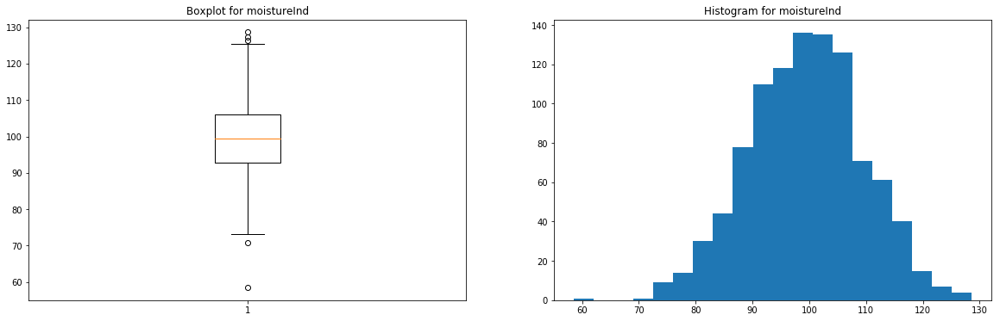
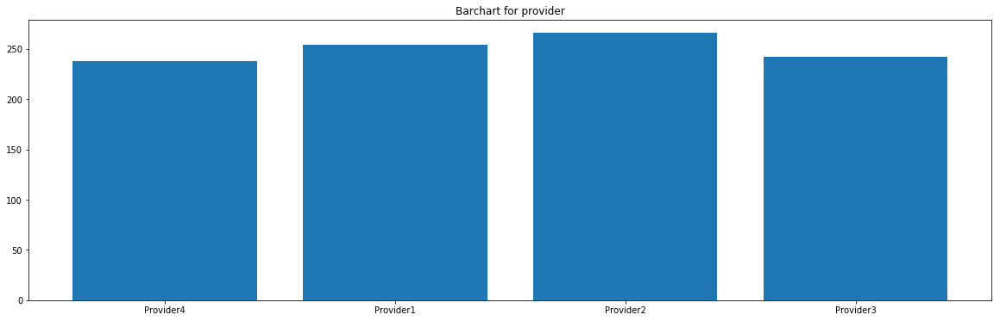
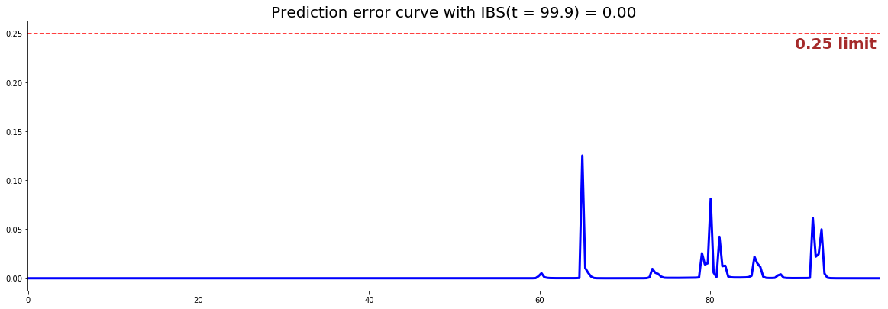

<!--  Tutorial - Predictive Maintenance -->
<style>
  h1, h2, h3, h4 { color: #04A9F4; }
</style>

# Predicting when a machine will break

## 1 - Introduction

[Predictive Maintenance (PdM)](https://en.wikipedia.org/wiki/Predictive_maintenance) is a great application of Survival Analysis since it consists in predicting when equipment failure will occur and therefore alerting the maintenance team to prevent that failure. Indeed, accurately modeling if and when a machine will break is crucial for industrial and manufacturing businesses as it can help:

* maintain a safe work environment by ensuring that machines are working properly
* increase productivity by preventing unplanned reactive maintenance and minimizing downtime
* optimize costs by removing the need for too many unnecessary checks or repairs of components -- a.k.a preventative maintenance

Within the past couple of years, thanks to the use of [Internet of Things (IoT) technologies](https://en.wikipedia.org/wiki/Internet_of_things#Manufacturing), a plethora of data has been generated by various sensors on machines, mechanical and electrical components, such as temperature, vibration, voltage or pressure. This type of information can be used to predict future failures.

---

## 2 - Set up

We will consider that a manufacturing company uses many machines to build their final products. The factory is using IoT technologies via smart sensors to measure and save various kind of inputs from the physical environment and the state of their equipment.

Unfortunately, every time a machine breaks the production is stopped, which costs the company thousands of dollars in repair and late delivery fees. The factory manager asks the company's Data Science team if it is possible to find a way to be more pro-active so as to optimize spending.

---

## 3 - Dataset

The dataset the team wants to use contains the following features:

|     Feature category             | Feature name        | Type        |  Description |
|----------------|-----------------|-------------|---------------------|
| <span style="color:blue"> Time </span>           | `lifetime`      | numerical   |  Number of weeks the machine has been active|
| <span style="color:blue"> Event </span>           | `broken`        | numerical   |  Specifies if the machine was broken or hasn't been broken yet for the corresponding weeks in activity |
| IoT measure    | `pressureInd`   | numerical   | The pressure index is used to quantify the flow of liquid through pipes, as a sudden drop of pressure can indicate a leak  |
| IoT measure    | `moistureInd`   | numerical   | The moisture index is a measure of the relative humidity in the air. It is important to keep track of it as excessive humidity can create mold and damage the equipment  |
| IoT measure    | `temperatureInd`| numerical   | The temperature index of the machine is computed using voltage devices called thermocouples that translate a change in voltage into temperature measure. It is recorded to avoid damages to electric circuits, fire or even explosion |
| Company feature| `team`          | categorical | This indicator specifies which team is using the machine |
| Machine feature| `provider`      | categorical | This indicator specifies the name of the machine manufacturer |

---

## 4 - Exploratory Data Analysis

Let's perform an exploratory data analysis (EDA) so as to understand what the data look like and start answering interesting questions about our problem.

```python
# Importing modules
import pandas as pd
import numpy as np
from matplotlib import pyplot as plt
from pysurvival.datasets import Dataset
%pylab inline  

# Reading the dataset
raw_dataset = Dataset('maintenance').load()
print("The raw_dataset has the following shape: {}.".format(raw_dataset.shape))
raw_dataset.head(3)
```

Here is an overview of the raw dataset:

| lifetime | broken | pressureInd | moistureInd | temperatureInd | team  | provider |
|----------|--------|-------------|-------------|----------------|-------|----------|
| 56       | 0      | 92.17     | 104.23    | 96.51      | TeamA | Provider4|
| 81       | 1      | 72.07     | 103.06    | 87.27      | TeamC | Provider4|
| 60       | 0      | 96.27     | 77.80     | 112.19     | TeamA | Provider1|

The following command is also very useful so as to assess the type of variables we're dealing with:
```python
raw_dataset.info()
```

There are 3 numerical features (`pressureInd`, `moistureInd`, `temperatureInd`) and 2 categorical features (`team`, `provider`).
Let's encode the categorical variables as  one-hot vectors and define the modeling features:
```python
# Defining the time and event column
time_column = 'lifetime'
event_column = 'broken'

# Encoding the categorical variables as one-hot vectors
categories = ['provider', 'team']
dataset = pd.get_dummies(raw_dataset, columns = categories, drop_first=True)

# Defining the modeling features
features = np.setdiff1d(dataset.columns, ['lifetime', 'broken']).tolist()
```


### 4.1 - Null values and duplicates
The first thing to do is checking if the dataset contains Null values and if it has duplicated rows.
```python
# Checking for null values
N_null = sum(dataset[features].isnull().sum())
print("The dataset contains {} null values".format(N_null)) #0 null values

# Removing duplicates if there exist
N_dupli = sum(dataset.duplicated(keep='first'))
dataset = dataset.drop_duplicates(keep='first').reset_index(drop=True)
print("The dataset contains {} duplicates".format(N_dupli))

# Number of samples in the dataset
N = dataset.shape[0]
```
As it turns out the dataset doesn't have any Null values or duplicates.


### 4.2 - Visual exploration and statistics
Let's check out/visualize the feature statistics:

#### 4.2.1 - Numerical features

We will display the boxplot and histogram of each feature
```python
for feature in ['pressureInd','moistureInd','temperatureInd']:

    # Creating an empty chart
    fig, ((ax1, ax2)) = plt.subplots(1, 2,  figsize=(15, 4))

    # Extracting the feature values
    x = raw_dataset[feature].values

    # Boxplot
    ax1.boxplot(x)
    ax1.set_title( 'Boxplot for {}'.format(feature) )

    # Histogram
    ax2.hist(x, bins=20)
    ax2.set_title( 'Histogram for {}'.format(feature) )

    # Display
    plt.show()
```

<center></center>
<center>Figure 1 - Boxplot and histogram for moistureInd</center>


<center></center>
<center>Figure 2 - Boxplot and histogram for pressureInd</center>


<center></center>
<center>Figure 3 - Boxplot and histogram for temperatureInd</center>


These features have very few outliers (*here, there's no real need to remove them, but you can if you prefer*) and seem to follow normal distributions.

#### 4.2.2 - Categorical features

We will display the occurrences of the categories in a barchart for each feature
```python
from collections import Counter
for feature in ['team','provider']:

    # Creating an empty chart
    fig, ax = plt.subplots(figsize=(15, 4))

    # Extracting the feature values
    x = raw_dataset[feature].values

    # Counting the number of occurrences for each category
    data = Counter(x)
    category = list(data.keys())
    counts = list(data.values())

    # Boxplot
    ax.bar(category, counts)

    # Display
    plt.title( 'Barchart for {}'.format(feature) )
    plt.show()
```

<center></center>
<center>Figure 4 - Barchart for team</center>

<center></center>
<center>Figure 5 - Barchart for provider</center>

These features seem to be uniformly distributed.


#### 4.2.3 - Time & Event
We will display the occurrences of event and censorship, as well as the distribution of the time output variable for both situations.
```python
# Creating an empty chart
fig, ((ax1, ax2)) = plt.subplots(1, 2,  figsize=(15, 4))

# Counting the number of occurrences for each category 
data = Counter(raw_dataset['broken'].replace({0:'not broken yet', 1:'broken'}))
category = list(data.keys())
counts = list(data.values())
idx = range(len(counts))

# Displaying the occurrences of the event/censoring
ax1.bar(idx, counts)
ax1.set_xticks(idx)
ax1.set_xticklabels(category)
ax1.set_title( 'Occurences of the event/censoring', fontsize=15)

# Showing the histogram of the survival times for the censoring
time_0 = raw_dataset.loc[ raw_dataset['broken'] == 0, 'lifetime']
ax2.hist(time_0, bins=30, alpha=0.3, color='blue', label = 'not broken yet')

# Showing the histogram of the survival times for the events
time_1 = raw_dataset.loc[ raw_dataset['broken'] == 1, 'lifetime']
ax2.hist(time_1, bins=20, alpha=0.7, color='black', label = 'broken')
ax2.set_title( 'Histogram - survival time', fontsize=15)

# Displaying everything side-by-side
plt.legend(fontsize=15)
plt.show()
```

<center></center>
<center>Figure 6 - Time/Event summary</center>


Here, we can see that 2/3 of the data is censored and that the failures start happening when the machine has been active for at least 60 weeks.

### 4.3 - Correlations

Let's compute and visualize the correlation between the features
```python
from pysurvival.utils.display import correlation_matrix
correlation_matrix(dataset[features], figure_size=(15, 5))
```

<center></center>
<center>Figure 7 - Correlations</center>


As we can see, there aren't any alarming correlations.

---

## 5 - Modeling

So as to perform cross-validation later on and assess the performances of the model, let's split the dataset into training and testing sets.
```python
# Building training and testing sets
from sklearn.model_selection import train_test_split
index_train, index_test = train_test_split( range(N), test_size = 0.4)
data_train = dataset.loc[index_train].reset_index( drop = True )
data_test  = dataset.loc[index_test].reset_index( drop = True )

# Creating the X, T and E inputs
X_train, X_test = data_train[features], data_test[features]
T_train, T_test = data_train[time_column], data_test[time_column]
E_train, E_test = data_train[event_column], data_test[event_column]
```

Let's now fit a [Linear MTLR](../models/linear_mtlr.md) model to the training set.
```python
from pysurvival.models.multi_task import LinearMultiTaskModel

# Initializing the MTLR with a time axis split into 300 intervals
linear_mtlr = LinearMultiTaskModel(bins=300)

# Fitting the model
linear_mtlr.fit(X_train, T_train, E_train, num_epochs = 1000,
                init_method = 'orthogonal', optimizer ='rmsprop', 
                lr = 1e-3, l2_reg = 3,  l2_smooth = 3, )
```

We can take a look at the loss function values

```python 
from pysurvival.utils.display import display_loss_values
display_loss_values(linear_mtlr, figure_size=(7, 4))
```

<center></center>
<center>Figure 8 - Linear MTLR loss function values</center>

---

## 6 - Cross Validation
In order to assess the model performance, we previously split the original dataset into training and testing sets, so that we can now compute its performance metrics on the testing set:

### 6.1 - [C-index](../metrics/c_index.md)
The [C-index](../metrics/c_index.md) represents the global assessment of the model discrimination power: ***this is the model’s ability to correctly provide a reliable ranking of the survival times based on the individual risk scores***. In general, when the C-index is close to 1, the model has an almost perfect discriminatory power; but if it is close to 0.5, it has no ability to discriminate between low and high risk subjects.

```python
from pysurvival.utils.metrics import concordance_index
c_index = concordance_index(linear_mtlr, X_test, T_test, E_test)
print('C-index: {:.2f}'.format(c_index)) #0.92
```

As the c-index (0.92 here) is close to 1, it seems that the model will yield satisfactory results in terms of survival times predictions.


### 6.2 - [Brier Score](../metrics/brier_score.md)

The ***[Brier score](../metrics/brier_score.md) measures the average discrepancies between the status and the estimated probabilities at a given time.***
Thus, the lower the score (*usually below 0.25*), the better the predictive performance. To assess the overall error measure across multiple time points, the Integrated Brier Score (IBS) is usually computed as well.

```python
from pysurvival.utils.display import integrated_brier_score
integrated_brier_score(linear_mtlr, X_test, T_test, E_test, t_max=100, 
                       figure_size=(20, 6.5) )
```

<center></center>
<center>Figure 9 - Linear MTLR - Brier scores & Prediction error curve </center>


The IBS is very close to 0.0 on the entire model time axis. This indicates that the model will have very good predictive abilities.

---

## 7 - Predictions

### 7.1 - Overall predictions
Now that we have built a model that seems to provide great performances, let's compare the time series of the actual and predicted number of machines experiencing a failure, for each time t.
```python
from pysurvival.utils.display import compare_to_actual
results = compare_to_actual(linear_mtlr, X_test, T_test, E_test,
                            is_at_risk = False,  figure_size=(16, 6), 
                            metrics = ['rmse', 'mean', 'median'])
```


<center></center>
<center>Figure 10 - Actual vs Predicted - Number of machines experiencing a failure</center>

Based on the performance metrics, it was expected that the time series would be very close; here the model makes an average error of ~1 machine throughout the entire timeline.


### 7.2 - Individual predictions
Now that we know that we can provide reliable predictions for an entire cohort. Let's compute the survival predictions at the individual level.

First, we can construct the risk groups based on risk scores distribution. The helper function `create_risk_groups`, which can be found in `pysurvival.utils`, will help us do that:
```python
from pysurvival.utils.display import create_risk_groups

risk_groups = create_risk_groups(model=linear_mtlr, X=X_test, 
    use_log = True, num_bins=50, figure_size=(20, 4),
    low= {'lower_bound':0, 'upper_bound':1.8, 'color':'red'}, 
    medium= {'lower_bound': 1.8, 'upper_bound':1.93, 'color':'green'},
    high= {'lower_bound':1.93, 'upper_bound':2.1, 'color':'blue'}
    )
```

<center></center>
<center>Figure 11 - Creating Risk groups</center>

*Note: The current choice of the lower and upper bounds for each group is based on my intuition; so feel free to change the values so as to match your situation instead.*

Here, we can see that 3 main groups, *low*, *medium* and *high* risk groups, can be created. Because the C-index is high, the model will be able to perfectly rank the survival times of a random unit of each group, such that $ t_{high}  \leq t_{medium} \leq t_{low}$.

Let's randomly select individual unit in each group and compare the survival functions. To demonstrate our point, we will purposely select units which experienced an event to visualize the actual time of event.
```python
# Initializing the figure
fig, ax = plt.subplots(figsize=(15, 8))

# Selecting a random individual that experienced failure from each group
groups = []
for i, (label, (color, indexes)) in enumerate(risk_groups.items()) :
    
    # Selecting the individuals that belong to this group
    if len(indexes) == 0 :
        continue
    X = X_test.values[indexes, :]
    T = T_test.values[indexes]
    E = E_test.values[indexes]
    
    # Randomly extracting a machine that experienced failure from each group
    choices = np.argwhere((E==1.)).flatten()
    if len(choices) == 0 :
        continue
    k = np.random.choice( choices, 1)[0]
    
    # Saving the time of event
    t = T[k]
    
    # Computing the Survival function for all times t
    survival = linear_mtlr.predict_survival(X[k, :]).flatten()

    # Displaying the functions
    label_ = '{} risk'.format(label)
    plt.plot(linear_mtlr.times, survival, color = color, label=label_, lw=2)
    groups.append(label)
    
    # Actual time
    plt.axvline(x=t, color=color, ls ='--')
    ax.annotate('T={:.1f}'.format(t), xy=(t, 0.5*(1.+0.2*i)), 
        xytext=(t, 0.5*(1.+0.2*i)), fontsize=12)

# Show everything
groups_str = ', '.join(groups)
title = "Comparing Survival functions between {} risk grades".format(groups_str)
plt.legend(fontsize=12)
plt.title(title, fontsize=15)
plt.ylim(0, 1.05)
plt.show()
```

<center></center>
<center>Figure 12 - Predicting individual survival functions</center>


As we can see, the model manages to perfectly predict the event time, here it corresponds to a sudden drop in the individual survival function.

---

## 8 - Conclusion
We can now save our model so as to put it in production and score future machines.
```python 
# Let's now save our model
from pysurvival.utils import save_model
save_model(linear_mtlr, '/Users/xxx/Desktop/pdm_linear_mtlr.zip')
```

In this example, we have shown that it is possible to predict with great degree of certainty when a machine will fail. The Data Science team could predict the machines survival function every day, so that 1 or 2 weeks before the machine is supposed to fail, the factory manager is notified so that the necessary actions can be taken.

---

## References

* [https://en.wikipedia.org/wiki/Predictive_maintenance](https://en.wikipedia.org/wiki/Predictive_maintenance)
* [Essec Business School - Course in Business Analytics](http://www.essec.edu/en/)
* [Maintenance dataset](https://github.com/ludovicbenistant/Management-Analytics/blob/master/Supply%20Chain/Maintenance%20(survival%20analysis)/maintenance_data.csv)
* [https://github.com/nicolasfguillaume/Strategic-Business-Analytics-with-R/blob/master/module4.md](https://github.com/nicolasfguillaume/Strategic-Business-Analytics-with-R/blob/master/module4.md)
